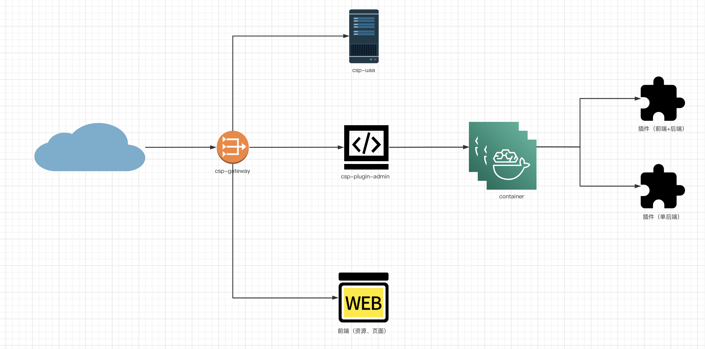
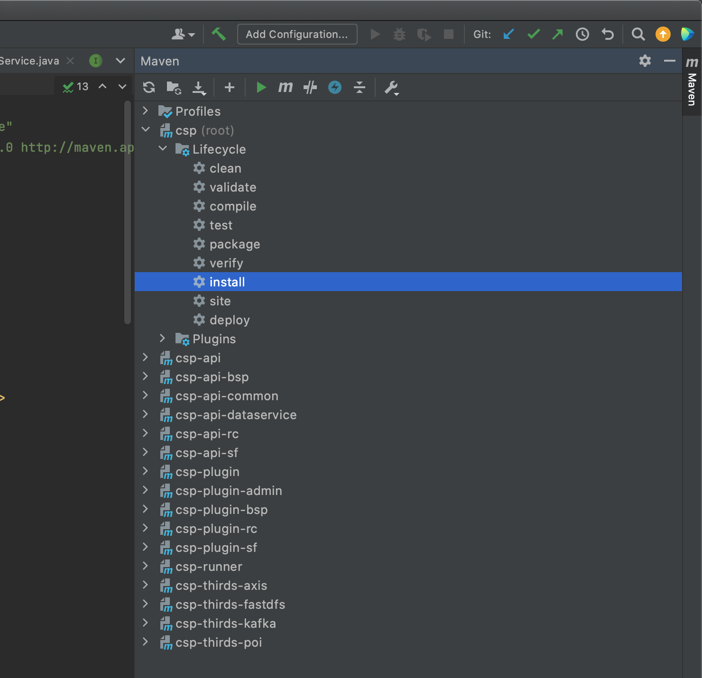
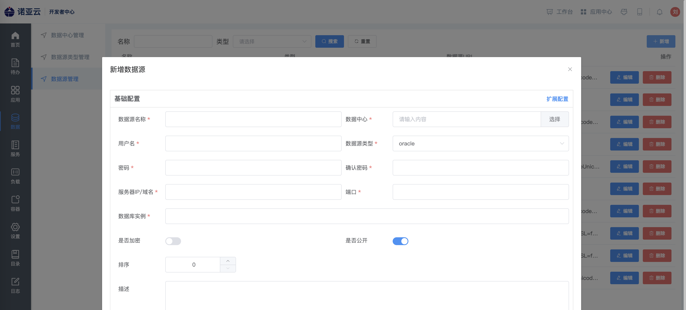
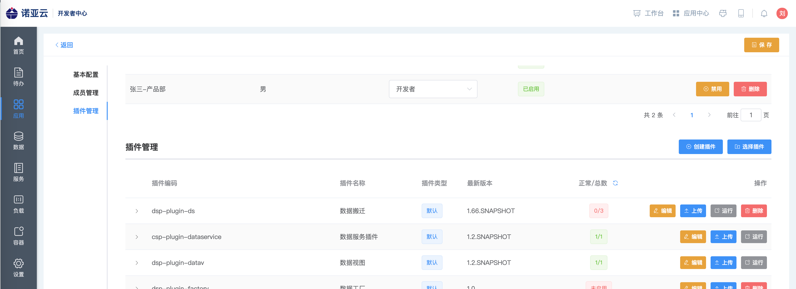
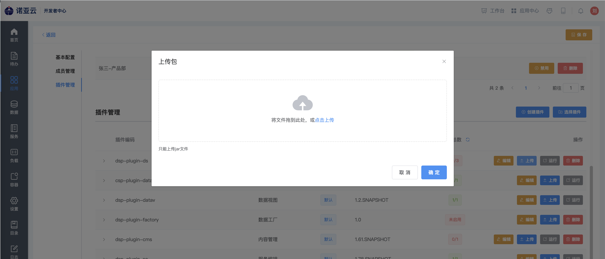
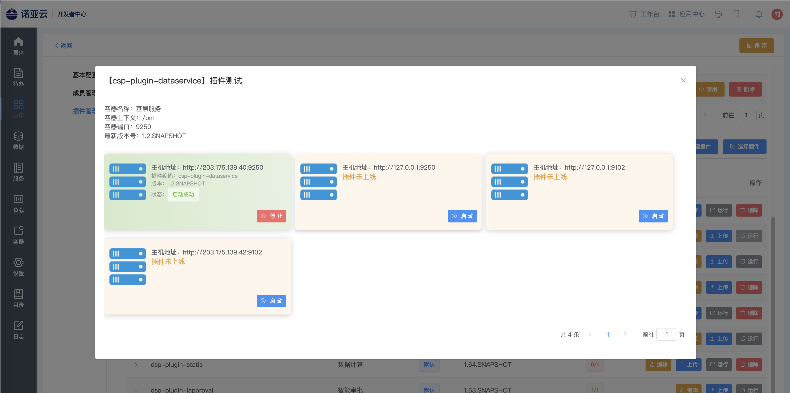

# 容器部署模式

## 部署架构

插件程序部署必要依赖：

1、csp-gateway：应用访问入口，应用部署整合的前置层

2、csp-uaa：身份认证插件，用于封装应用登录相关的身份认证能力

3、csp-plugin-admin：开发者中心

## 部署过程

### 准备工作

    JDK >= 1.8 (推荐1.8版本)
    Mysql >= 5.7.0 (推荐5.7版本)
    Maven >= 3.0
    csp-gateway >= 1.0-SNAPSHOT
    csp-uaa >= 1.0-SNAPSHOT

### 打包部署

1、修改Profiles，执行maven打包

2、创建数据库并在开发者中心配置数据库

创建数据库dv_db_news并导入数据脚本 [pub_news.sql](./deploy/database/pub_news.sql) 、 [pub_news_type.sql](./deploy/database/pub_news_type.sql)
在开发者中心配置数据库，并获得数据源id

3、将插件生成的版本包上传至开发者中心

{{name}}-plugin/{{name}}-plugin-{{pluginName}}/target/{{name}}-plugin-{{pluginName}}-1.0.SNAPSHOT.jar

登录开发者中心，访问：数据 -> 数据源服务 -> 新增 -> 配置对应数据库链接（此时会获得一个数据源id）

4、创建或打开应用管理

登录开发者中心 -> 访问应用 -> 应用商店 -> 选择对应应用

上传插件

根据{{name}}-plugin/{{name}}-plugin-{{pluginName}}/src/main/resources/plugin.properties中配置的plugin.id对应插件id。
且需要注意，版本不可重复！

容器部署插件（选择对应的容器，选择对应的插件版本，再点击启动）

### 常见问题

#### 如何在线调试后台接口

    访问http://127.0.0.1:{{backendPort}}/doc.html，以swagger2在线接口文档方式进行调试

#### linux上如何运行程序

    程序启动：${程序部署目录}/{{name}}-runner/bin/startup.sh start
    控制台调试：${程序部署目录}/{{name}}-runner/bin/startup.sh console
    程序关闭：${程序部署目录}/{{name}}-runner/bin/startup.sh stop
    更多命令：${程序部署目录}/{{name}}-runner/bin/startup.sh，根据提示选择

