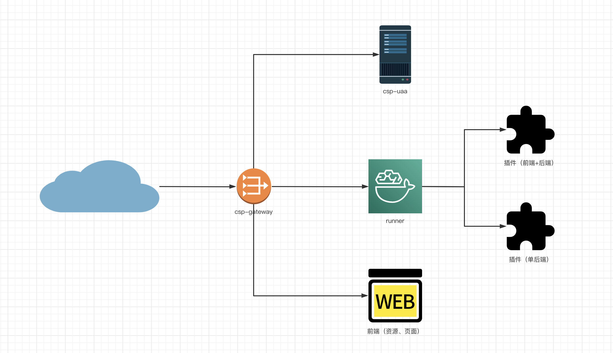

# runner部署模式


## 部署架构


    
插件程序部署必要依赖：

1、csp-gateway：应用访问入口，应用部署整合的前置层

2、csp-uaa：身份认证插件，用于封装应用登录相关的身份认证能力


## 部署过程


### 准备工作

    JDK >= 1.8 (推荐1.8版本)
    Mysql >= 5.7.0 (推荐5.7版本)
    Maven >= 3.0
    csp-gateway >= 1.0-SNAPSHOT
    csp-uaa >= 1.0-SNAPSHOT


### 打包部署

1、修改Profiles，执行maven打包

[程序打包](./images/maven.png)

2、创建数据库dv_db_news并导入数据脚本 [pub_news.sql](./deploy/database/pub_news.sql) 、 [pub_news_type.sql](./deploy/database/pub_news_type.sql)

3、将install生成的内容以如下规则拷贝上服务器

    chendeming-runner/target/chendeming-runner -> ${程序部署目录}/chendeming-runner
    
    chendeming-plugin/chendeming-plugin-news/target/chendeming-plugin-news-1.0.SNAPSHOT.jar -> ${程序部署目录}/chendeming-runner/chendeming-plugin

    chendeming-plugin/chendeming-plugin-news/src/main/resources/chendeming-plugin-news.yml -> ${程序部署目录}/chendeming-runner/pluginFile
   
4、注册服务

    运行${程序部署目录}/chendeming-runner/bin/install.bat

    备注：如果运行成功，在windows服务列表中能够看到对应服务

5、启动程序

    运行${程序部署目录}/chendeming-runner/bin/startup.bat

### 必要配置

1、${程序部署目录}/chendeming-runner/application-dev.yml

```yaml
plugin:
  # 运行项目时的模式。分为开发环境(dev)、生产环境(prod)
  runMode: prod
  # 插件的路径。开发环境建议直接配置为插件模块的父级目录。例如: plugins。如果启动主程序时, 插件为加载, 请检查该配置是否正确。
  pluginPath: ./chendeming-plugin
  # 插件配置文件
  pluginConfigFilePath: ./pluginFile

spring:
  datasource:
    dynamic:
      configClz: org.jangod.iweb.mapp.config.DataSourceConfig
      enabled: true
      primary: master
      strict: true
      datasource:
        master:
          driverClassName: org.h2.Driver
          url: jdbc:h2:mem:h2temp
        demo:
          driverClassName: com.mysql.jdbc.Driver
          url: ''
          username: 
          password: ''
```

### 常见问题

#### 如何在线调试后台接口

    访问http://127.0.0.1:9302/doc.html，以swagger2在线接口文档方式进行调试

#### linux上如何运行程序

    程序启动：${程序部署目录}/chendeming-runner/bin/startup.sh start
    控制台调试：${程序部署目录}/chendeming-runner/bin/startup.sh console
    程序关闭：${程序部署目录}/chendeming-runner/bin/startup.sh stop
    更多命令：${程序部署目录}/chendeming-runner/bin/startup.sh，根据提示选择


